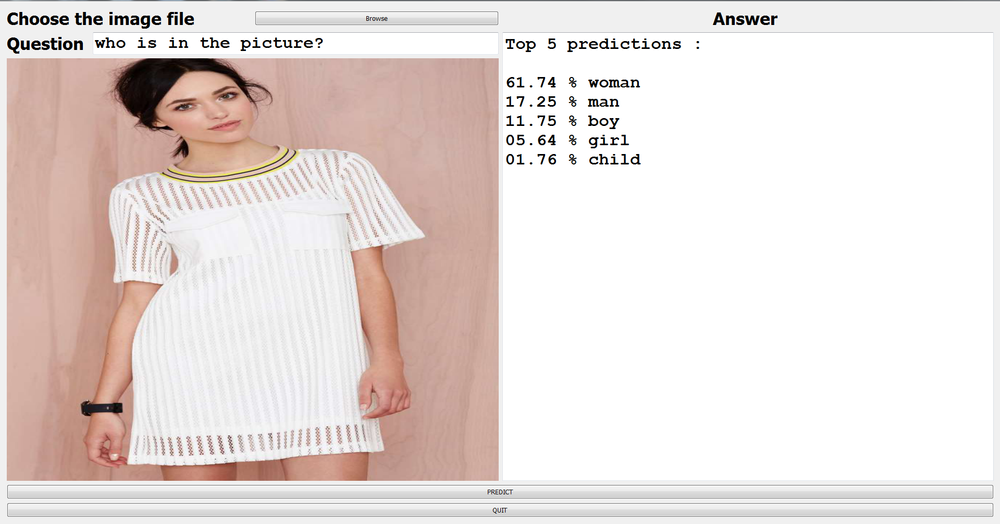

# VQA-Demo-GUI
Image Recognition through asking question answer
In this project we have created a platform to focus on all aspects of images and not just small areas, doing this through LSTM, CNN and Transfer Learning. We have used the weights found in VGG16 model while also training a LSTM to achieve the desired combo.
This model is GUI based application in which first we include an image and then ask a question based on the image, and a get a probabilistic reply. 
Our model is shown below.

This repository gives a GUI  using PyQt4 for VQA demo using Keras Deep Learning Library. The VQA model is created using Pre-trained VGG-16 Weight for image Features and glove vectors for question Features. 
Run the VQA-VGG-16+LSTM-GUI.py script to run the GUI demo.

Read the loading en_glove vectors.txt if you are facing problem with loading the languauge model

## Model Idea

This uses a classical CNN-LSTM model like shown below, where Image features and language features are computed separately and combined together and a multi-layer perceptron is trained on the combined features.

Similar models have been presented at following links, this work takes ideas from them.

    https://github.com/abhshkdz/neural-vqa
    https://github.com/avisingh599/visual-qa
    https://github.com/VT-vision-lab/VQA_LSTM_CNN
    

### Extract Image features

Extracting image features involves, taking a raw image, and running it through the model, until we reach the last layer. In this case our model is not 100% same as VGG Net, because we are not going to use the last two layer of the VGG. It is because the last layer of VGG Net is a 1000 way softmax and the second last layer is the Dropout.

Thus we are extracting the 4096 Dimension image features from VGG-16

### Word Embeddings

The question has to be converted into some form of word embeddings. Most popular is Word2Vec whereas these days state of the art uses skip-thought vectors or positional encodings.

We will use Word2Vec from Stanford called Glove. Glove reduces a given token into a 300 dimensional representation.

# VQA Model

VQA is a simple model which combines features from Image and Word Embeddings and runs a multiple layer perceptron.

As it can be seen above the model also runs a 3 layered LSTM on the word embeddings. To get a naive result it is sufficient to feed the word embeddings directly to the merge layer, but as mentioned above the model gives close to the state-of-the-art results.

Also, four layers of fully connected layers might not be required to achieve a good enough results. But I settled on this model after some experimentation, and this model's results beat those obtained using only few layers.

